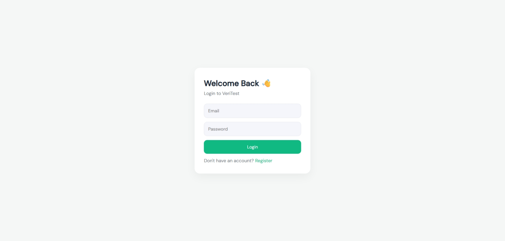
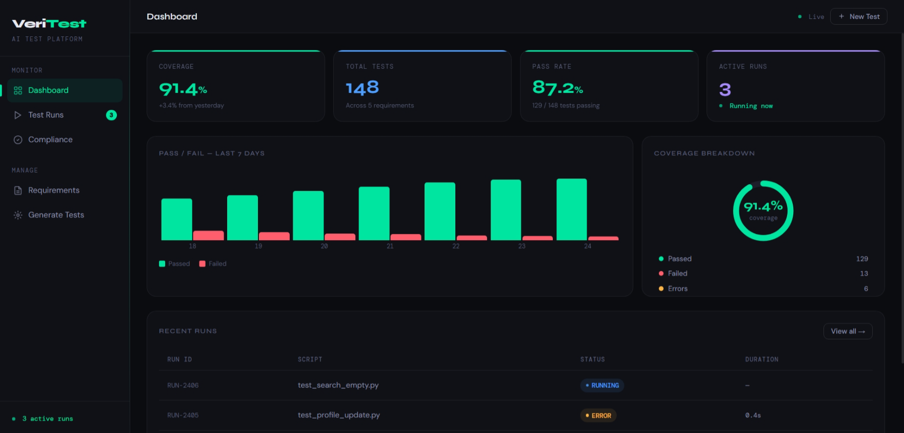
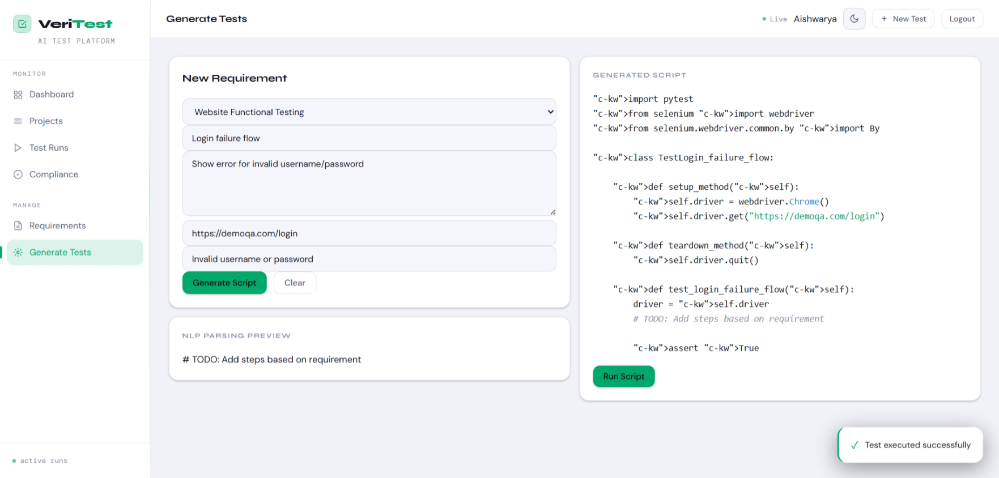
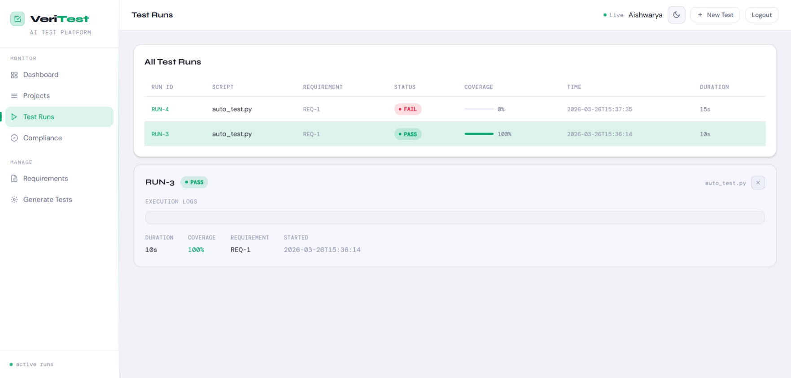

#  VeriTest – Automated Test Generation & Execution Platform

VeriTest is a full-stack web application that enables users to **create test requirements, generate automated test scripts, execute them using Selenium, and visualize results through an interactive dashboard**.

---

##  Features

###  Requirement Management
- Create and manage test requirements
- Define:
  - Title
  - Description
  - Target URL
  - Expected validation text

---

###  Automated Test Generation
- Converts natural language requirements into executable test scripts
- Displays generated script instantly
- Shows parsed actions preview

---

###  Test Execution (Selenium)
- Executes tests using Selenium WebDriver
- Validates expected text on web pages
- Tracks:
  - Status (PASS / FAIL / RUNNING)
  - Duration
  - Execution logs

---

###  Dashboard Analytics
- Visual summary of test execution
- Displays:
  - Total tests
  - Pass rate
  - Active runs
- Charts:
  - Pass vs Fail trends
  - Coverage trends
- Shows recent runs

---

###  Test Runs Tracking
- View all executed test runs
- Expand each run to see:
  - Logs
  - Status
  - Coverage
  - Duration
- Real-time status indicators

---

##  Tech Stack

### Frontend
- React.js
- Recharts
- Custom CSS / Tailwind

### Backend
- FastAPI
- SQLAlchemy
- MySQL

### Automation
- Selenium WebDriver
- ChromeDriver (webdriver-manager)

---

##  Screenshots
Login Page

  

dashboard Page

  

Test Page

  

Run Page

  

